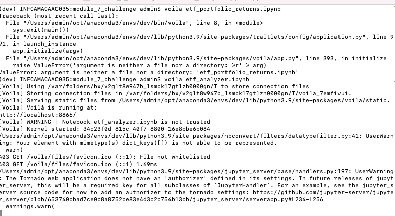

## module 7 challenge
### Passive investing means that you invest in a basket of assets that’s called an exchange-traded fund (ETF). This way, you don’t spend time researching individual stocks or companies or take the risk of investing in a single stock. ETFs offer more diversification.In this Challenge assignment, you’ll build a financial database and web application by using SQL, Python, and the Voilà library to analyze the performance of a hypothetical fintech ETF.
### Author : Anurag Garg
### Submission Date : 01/19/2022

In this program new libraries that are used :  
1) sqlachemy  
2) voila  
----
screenshot of voila invocation:  

